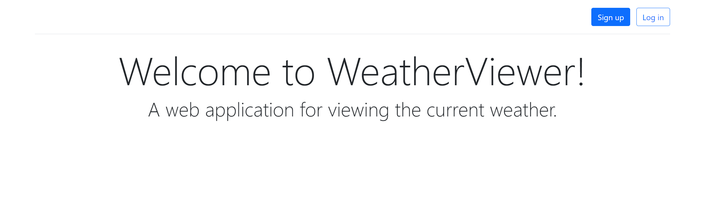
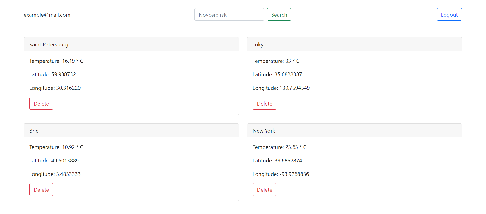

## The WeatherViewer project
Web application for viewing the current weather. The user can register and add one or more locations (cities, villages, other points) to the collection, after which the main page of the application starts displaying the list of locations with their current weather.

The author of the terms of reference is https://github.com/zhukovsd



## Project Motivation
- Using cookies and sessions to authorize users without frameworks
- Working with external APIs

## Build and Run

In the root directory, execute the build using Gradle Wrapper:

For Unix:

```bash
./gradlew clean build
```
For Windows:

```cmd
gradlew.bat clean build
```

Deploy the WAR file to your Apache Tomcat.

Copy the WAR file to the `webapps` directory of your Tomcat installation.
Start your servlet container.

For Unix:

```bash
<tomcat-directory>/bin/startup.sh
```
For Windows:

```cmd
<tomcat-directory>\bin\startup.bat
```
## Technologies / tools used
- Java Servlets
- Hibernate, PostgreSQL
- thymeleaf, Bootstrap
- Lombok, Jackson, Gradle
- Junit, Mockito

The [OpenWeatherMap](https://openweathermap.org/) api was used to get up-to-date weather data.
## App features
### User related
- Sign up

- Login 

- Logout

### Location related
- Search locations

- Add location
- View location

- Delete location
## License
This project uses the [MIT license](LICENSE).